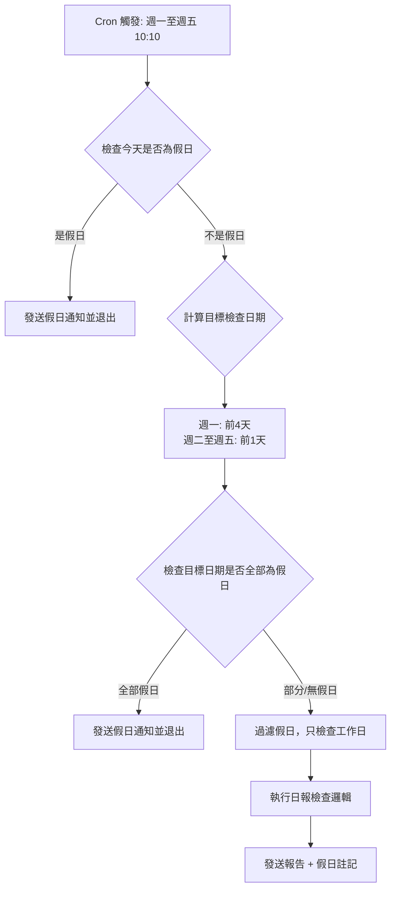

# 📅 Gemini 每日彙報檢查 - 國定假日智能處理功能

## 📋 版本資訊

- **功能版本**: v2.0（含假日檢測）
- **實作日期**: 2024-12-26
- **適用年份**: 2025-2026（可擴展）
- **Workflow 文件**: `gemini-daily-report-checker-with-holiday.json`

## 🎯 問題背景

### 原始問題

在**沒有假日檢測**的版本中，遇到國定假日時會發生誤報：

#### 情境：2025/12/25（行憲紀念日，星期四）

```
⏰ Workflow 執行時間: 12/25 10:10 AM
📅 檢查日期: 12/24（前一天）

❌ 問題：
- 12/25 是國定假日，Cron 仍會執行（無法識別假日）
- 如果 12/24 也是假日，所有人都沒提交日報
- 系統會誤報「所有 30 人未提交」，造成團隊困擾
```

### 解決方案

**方案 1 + 方案 3**：假日清單檢測 + 智能通知邏輯

1. ✅ **方案 1**：內建 2025-2026 台灣國定假日清單
2. ✅ **方案 3**：三層假日檢測邏輯

---

## 🏗️ 架構設計

### 三層假日檢測邏輯



### 層級說明

#### 第 1 層：當天假日檢查
**位置**: 「查詢並處理資料」節點開頭

```javascript
// 檢查今天是否為假日
const todayDateStr = `${year}-${month}-${day}`;
if (holidays[year][todayDateStr]) {
  return [{
    json: {
      isHoliday: true,
      message: `🏖️ 今天是國定假日：${holidayName} (${todayDateStr})\n無需檢查日報，祝您假期愉快！`
    }
  }];
}
```

**情境範例**：
- 今天是 2025/12/25（行憲紀念日）
- Cron 仍會執行，但直接發送假日通知並退出

#### 第 2 層：目標日期假日過濾
**位置**: 計算目標日期後

```javascript
// 檢查目標日期是否為假日
for (const date of targetDates) {
  const dateStr = `${year}-${month}-${day}`;

  if (holidays[year][dateStr]) {
    holidayDates.push({ date: dateStr, name: holidays[year][dateStr] });
  } else {
    targetDateStrs.push(dateStr);  // 工作日
  }
}

// 如果所有檢查日期都是假日
if (targetDateStrs.length === 0 && holidayDates.length > 0) {
  return [{
    json: {
      isHoliday: true,
      message: `🏖️ 檢查日期皆為國定假日：${holidayInfo}\n無需檢查日報，祝您假期愉快！`
    }
  }];
}
```

**情境範例**：
- 今天是週一 2025/02/03，檢查前4天：1/31, 2/1, 2/2, 2/3（全是春節）
- 所有日期都是假日，發送通知並退出

#### 第 3 層：部分假日註記
**位置**: 發送通知節點

```javascript
// 如果部分日期為假日，在報告中說明
const holidayNote = holidayDates.length > 0
  ? `\n\nℹ️ 以下日期為國定假日，已排除：${holidayInfo}`
  : '';
```

**情境範例**：
- 今天是週一 2025/05/05，檢查前4天：5/1（勞動節）, 5/2（調整放假）, 5/3, 5/4
- 5/1 和 5/2 是假日，只檢查 5/3 和 5/4
- 報告會註記「5/1 勞動節、5/2 勞動節調整放假 已排除」

---

## 📊 假日清單配置

### 2025 年台灣國定假日（25 天）

| 日期 | 假日名稱 | 連假說明 |
|------|---------|---------|
| 2025-01-01 | 元旦 | 1/1 (三) |
| 2025-01-25~02-02 | 農曆春節 | 9天連假 (含小年夜) |
| 2025-02-28 | 和平紀念日 | 2/28 (五) - 3/2 (日) |
| 2025-04-03~04 | 兒童節/清明節 | 4/3 (四) - 4/6 (日) |
| 2025-05-01~02 | 勞動節 | 可連休至 5/4 (日) |
| 2025-05-30~31 | 端午節 | 5/30 (五) - 6/1 (日) |
| 2025-09-29 | 教師節補假 | 9/28補假至9/29 |
| 2025-10-04~06 | 中秋節 | 10/4 (六) - 10/6 (一) |
| 2025-10-10~11 | 國慶日 | 10/10 (五) - 10/12 (日) |
| 2025-10-24 | 台灣光復節補假 | 10/25補假至10/24 |
| 2025-12-25 | 行憲紀念日 | 12/25 (四) |

**完整清單**: 請參閱 `holiday-config.js` 文件

### 2026 年台灣國定假日（31 天）

| 日期 | 假日名稱 | 連假說明 |
|------|---------|---------|
| 2026-01-01 | 元旦 | 1/1 (四) |
| 2026-02-14~22 | 農曆春節 | 9天連假 |
| 2026-02-27~28 | 和平紀念日 | 2/27 (五) - 3/1 (日) |
| 2026-04-03~06 | 兒童節/清明節 | 4/3 (五) - 4/6 (一) |
| 2026-05-01~02 | 勞動節 | 5/1 (五) - 5/3 (日) |
| 2026-06-19~20 | 端午節 | 6/19 (五) - 6/21 (日) |
| 2026-09-25~28 | 中秋節/教師節 | 9/25 (五) - 9/28 (一) |
| 2026-10-09~10 | 國慶日 | 10/9 (五) - 10/11 (日) |
| 2026-10-24~26 | 台灣光復節 | 10/24 (六) - 10/26 (一) |
| 2026-12-25~26 | 行憲紀念日 | 12/25 (五) - 12/27 (日) |

**完整清單**: 請參閱 `holiday-config.js` 文件

---

## 🔧 技術實作細節

### Workflow 節點修改

#### 1. 「查詢並處理資料」節點

**新增功能**：

```javascript
// ============================================================================
// 台灣國定假日清單 (2025-2026)
// ============================================================================
const holidays = {
  2025: { /* 25 天假日 */ },
  2026: { /* 31 天假日 */ }
};

function getHolidaysByYear(year) {
  return holidays[year] || {};
}

// 檢查當天是否為假日
const todayYear = taipeiTime.getFullYear();
const todayDateStr = `${todayYear}-${month}-${day}`;
const holidayList = getHolidaysByYear(todayYear);

if (holidayList[todayDateStr]) {
  return [{
    json: {
      slackToken,
      notifyChannel,
      isHoliday: true,
      holidayDate: todayDateStr,
      holidayName: holidayList[todayDateStr],
      message: `🏖️ 今天是國定假日...`
    }
  }];
}

// 過濾目標日期中的假日
const holidayDates = [];
for (const date of targetDates) {
  const dateStr = `${year}-${month}-${day}`;
  if (holidayList[dateStr]) {
    holidayDates.push({ date: dateStr, name: holidayList[dateStr] });
  } else {
    targetDateStrs.push(dateStr);
  }
}

// 如果所有日期都是假日
if (targetDateStrs.length === 0 && holidayDates.length > 0) {
  return [{ json: { isHoliday: true, message: ... } }];
}
```

#### 2. 「發送通知」節點

**新增功能**：

```javascript
// 處理假日情況
if (data.isHoliday) {
  const holidayMsg = data.message;

  await this.helpers.httpRequest({
    method: 'POST',
    url: 'https://slack.com/api/chat.postMessage',
    headers: { ... },
    body: {
      channel: notifyChannel,
      text: holidayMsg
    }
  });

  return [{ json: { sent: true, isHoliday: true } }];
}

// 正常報告加入假日註記
if (data.holidayNote) {
  message += data.holidayNote;
}
```

---

## 📱 通知訊息範例

### 情境 1：當天是假日

```
🏖️ 今天是國定假日：行憲紀念日 (2025-12-25)
無需檢查日報，祝您假期愉快！
```

### 情境 2：檢查日期全部是假日

```
🏖️ 檢查日期皆為國定假日：春節初一 (2025-01-27)、春節初二 (2025-01-28)、春節初三 (2025-01-29)
無需檢查日報，祝您假期愉快！
```

### 情境 3：部分日期是假日

```
📊 *每日彙報檢查報告*
📅 檢查日期: 2025-05-03, 2025-05-04

👥 需追蹤人數: 30
✅ 已提交: 28 人
🏖️ 請假: 0 人
❌ 未提交: 2 人

*已提交名單:*
• Alice (submitted at 2025-05-03 09:15:23)
• Bob (submitted at 2025-05-03 09:20:15)
...

*未提交名單:*
• Charlie
• David

ℹ️ 以下日期為國定假日，已排除：勞動節 (2025-05-01)、勞動節調整放假 (2025-05-02)
```

---

## 🔄 年度維護指南

### 每年必做事項

#### 1. 更新假日清單（12 月底）

**時間點**: 每年 12 月行政院人事行政總處公告隔年行事曆後

**步驟**：

1. 查詢政府行事曆：https://www.dgpa.gov.tw/
2. 編輯 `gemini-daily-report-checker-with-holiday.json`
3. 在「查詢並處理資料」節點的 `holidays` 物件中新增年份：

```javascript
const holidays = {
  2025: { /* ... */ },
  2026: { /* ... */ },
  2027: {  // 新增 2027 年
    '2027-01-01': '元旦',
    '2027-02-10': '小年夜',
    // ... 其他假日
  }
};
```

4. 更新 `getHolidaysByYear()` 函數（如果需要）
5. 測試 workflow
6. 部署到 n8n

#### 2. 移除舊年份資料（可選）

**時間點**: 每年 2 月初（春節後）

**步驟**：

```javascript
// 可以移除兩年前的資料以減小 payload
const holidays = {
  // 移除 2025: { ... },  // 已過期
  2026: { /* ... */ },
  2027: { /* ... */ },
  2028: { /* ... */ }
};
```

---

## 🧪 測試案例

### 測試清單

#### 1. 當天假日測試

```bash
# 模擬日期：2025/12/25（行憲紀念日）
# 預期結果：發送假日通知，不執行檢查

✅ 預期通知: "今天是國定假日：行憲紀念日 (2025-12-25)"
✅ 執行時間: < 5 秒
✅ API 呼叫: 1 次（只發送通知）
```

#### 2. 目標日期全部假日測試

```bash
# 模擬日期：2025/02/03（週一）
# 檢查日期：1/31, 2/1, 2/2, 2/3（全是春節）
# 預期結果：發送假日通知，不執行檢查

✅ 預期通知: "檢查日期皆為國定假日：春節初五、春節初六、春節初七..."
```

#### 3. 部分假日測試

```bash
# 模擬日期：2025/05/05（週一）
# 檢查日期：5/1（勞動節）, 5/2（調整放假）, 5/3, 5/4
# 預期結果：只檢查 5/3 和 5/4，報告中註記 5/1、5/2

✅ 檢查日期: 2025-05-03, 2025-05-04
✅ 假日註記: "勞動節 (2025-05-01)、勞動節調整放假 (2025-05-02)"
```

#### 4. 正常工作日測試

```bash
# 模擬日期：2025/03/11（週二）
# 檢查日期：3/10（非假日）
# 預期結果：正常執行檢查

✅ 檢查日期: 2025-03-10
✅ 無假日註記
✅ 正常統計提交狀況
```

### 手動測試步驟

#### 方法 1：修改 Cron 時間

```javascript
// 暫時修改為立即執行
"expression": "* * * * *"  // 每分鐘執行一次（測試用）

// 測試完恢復
"expression": "10 10 * * 1-5"  // 週一至週五 10:10
```

#### 方法 2：使用 n8n 手動執行

1. 登入 https://n8n.ftgaming.cc
2. 開啟 Workflow
3. 點擊「Execute Workflow」手動觸發
4. 查看執行結果和 Slack 通知

#### 方法 3：使用 Node.js 測試腳本

```bash
cd /Users/lonelyhsu/gemini/claude-project/n8n-workflow
node test-holiday-logic.js "2025-12-25"  # 測試特定日期
```

---

## 📂 相關檔案

| 檔案 | 說明 |
|------|------|
| `gemini-daily-report-checker-with-holiday.json` | 含假日檢測的完整 Workflow |
| `holiday-config.js` | 假日配置檔案（供參考） |
| `HOLIDAY-HANDLING-GUIDE.md` | 本文件 |
| `README-gemini-daily-report.md` | 原始 Workflow 文檔 |

---

## 🐛 故障排除

### 問題 1：假日仍然執行檢查

**可能原因**：
- Workflow 使用舊版本（未包含假日邏輯）
- 假日清單中沒有該日期

**解決方案**：
1. 確認 Workflow ID 和版本
2. 檢查假日清單是否包含該日期
3. 手動執行 Workflow 查看日誌

### 問題 2：假日清單未更新

**症狀**：2026 年 1 月仍使用 2025 年假日清單

**解決方案**：
1. 檢查 `getHolidaysByYear()` 函數
2. 確認 `holidays` 物件包含 2026 年資料
3. 重新部署 Workflow

### 問題 3：錯誤的假日通知

**症狀**：工作日被誤判為假日

**解決方案**：
1. 檢查假日清單日期格式（YYYY-MM-DD）
2. 確認時區設定（台北時區 UTC+8）
3. 查看執行日誌，確認 `todayDateStr` 值

---

## 💡 最佳實踐

### 1. 假日清單管理

- ✅ 每年 12 月更新隔年假日清單
- ✅ 保留最近 3 年假日資料
- ✅ 使用政府公告的官方日期
- ✅ 包含調整放假和補班日

### 2. 測試策略

- ✅ 每年初測試春節連假情境
- ✅ 月初測試上月底假日
- ✅ 使用手動執行模式測試
- ✅ 監控 Slack 通知內容正確性

### 3. 維護計畫

- ✅ 每年 12 月：更新假日清單
- ✅ 每季：檢視 Workflow 執行成功率
- ✅ 每月：審查異常通知記錄
- ✅ 每週：監控 Workflow 健康狀態

---

## 📞 支援資訊

- **維護團隊**: DevOps Team
- **技術文檔**: `/Users/lonelyhsu/gemini/claude-project/n8n-workflow/`
- **n8n 實例**: https://n8n.ftgaming.cc
- **Slack Channel**: #gemini-每日彙報 (C07KLQ81N2X)

---

## 📄 授權

Internal use only - FunTech Gaming

---

## 🎉 總結

透過**方案 1 + 方案 3**的實作，Workflow 現在具備：

✅ **智能假日檢測** - 自動識別台灣國定假日
✅ **三層防護邏輯** - 當天/目標日期/部分假日全面涵蓋
✅ **清楚的假日通知** - 明確告知假日資訊
✅ **工作日精準檢查** - 只檢查需要的工作日
✅ **易於維護** - 每年僅需更新假日清單

**再也不會在假日誤報所有人未提交日報了！** 🎊
